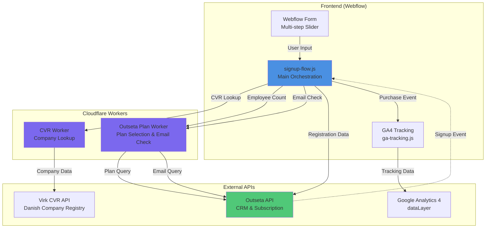
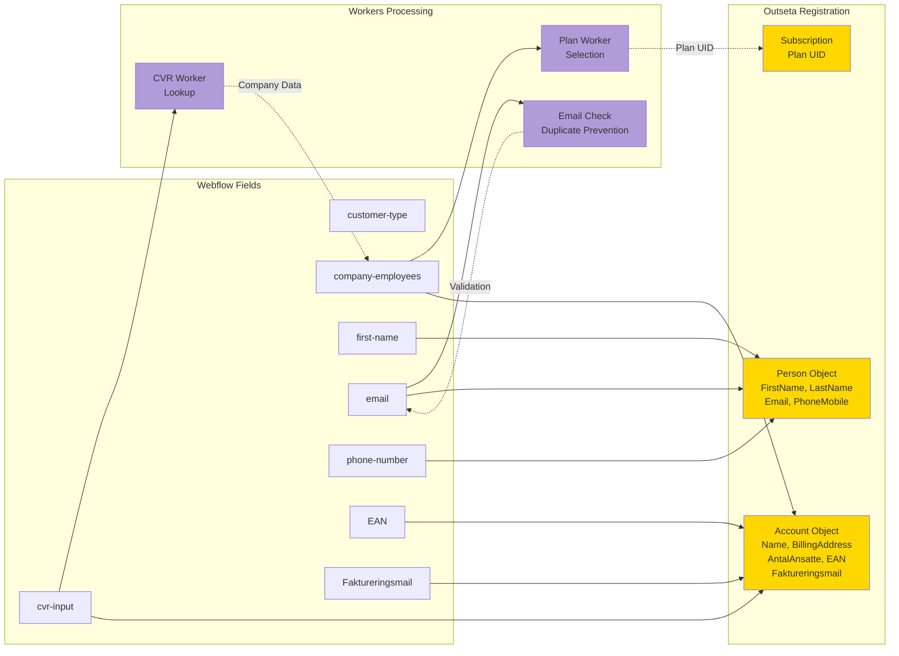

# Signup Flow

## Architecture

```mermaid
graph TB
    subgraph "Frontend (Webflow)"
        WF[Webflow Form<br/>Multi-step Slider]
        JS[signup-flow.js<br/>Main Orchestration]
        GA[GA4 Tracking<br/>ga-tracking.js]
    end
    
    subgraph "Cloudflare Workers"
        CVR[CVR Worker<br/>Company Lookup]
        PLAN[Outseta Plan Worker<br/>Plan Selection & Email Check]
    end
    
    subgraph "External APIs"
        CVRAPI[Virk CVR API<br/>Danish Company Registry]
        OUTSETA[Outseta API<br/>CRM & Subscription]
        GA4[Google Analytics 4<br/>dataLayer]
    end
    
    WF -->|User Input| JS
    JS -->|CVR Lookup| CVR
    JS -->|Employee Count| PLAN
    JS -->|Email Check| PLAN
    JS -->|Registration Data| OUTSETA
    JS -->|Purchase Event| GA
    
    CVR -->|Company Data| CVRAPI
    PLAN -->|Plan Query| OUTSETA
    PLAN -->|Email Query| OUTSETA
    GA -->|Tracking Data| GA4
    
    OUTSETA -.->|Signup Event| JS
    
    style JS fill:#4A90E2
    style CVR fill:#7B68EE
    style PLAN fill:#7B68EE
    style OUTSETA fill:#50C878
```

## User Flow

```mermaid
flowchart TD
    START([User Starts Signup])
    
    CTYPE{Customer Type}
    CTYPE -->|Privat| PLAN_SEL
    CTYPE -->|Erhverv| PLAN_SEL
    CTYPE -->|Offentlig| CONTACT_SALES
    CTYPE -->|Uddannelse| CONTACT_SALES
    
    PLAN_SEL[Select Plan<br/>Basis or Pro]
    
    CVR_CHECK{CVR Input<br/>Company Lookup}
    PLAN_SEL --> CVR_CHECK
    
    CVR_CHECK -->|Valid| COMPANY_INFO[Company Info<br/>Auto-filled]
    CVR_CHECK -->|Invalid/Error| CVR_ERROR[Show Error]
    CVR_ERROR --> CVR_CHECK
    
    COMPANY_INFO --> PLAN_CALC[Plan Calculation<br/>Based on Employees]
    
    PLAN_CALC --> PLAN_REVIEW[Review Plan<br/>& Price]
    
    PLAN_REVIEW --> INVOICING[Invoicing Details<br/>EAN & Email]
    
    INVOICING --> CONTACT_INFO[Contact Info<br/>Name, Email, Phone]
    
    CONTACT_INFO --> EMAIL_CHECK{Email<br/>Already Exists?}
    EMAIL_CHECK -->|Yes| EMAIL_ERROR[Show Duplicate Error]
    EMAIL_CHECK -->|No| VALIDATE
    EMAIL_ERROR --> CONTACT_INFO
    
    VALIDATE{Validate<br/>Required Fields}
    VALIDATE -->|Missing| FIELD_ERROR[Show Field Errors]
    VALIDATE -->|Complete| OUTSETA_POPUP
    FIELD_ERROR --> CONTACT_INFO
    
    OUTSETA_POPUP[Open Outseta<br/>Registration Popup]
    
    OUTSETA_POPUP --> PAYMENT[User Completes<br/>Payment]
    
    PAYMENT --> GA_TRACK[Fire GA Purchase Event<br/>Transaction ID: ANV-YYYYMMDD-XXXX]
    
    GA_TRACK --> COMPLETE([Registration Complete])
    
    CONTACT_SALES[Contact Sales Info<br/>For Public/Education]
    CONTACT_SALES --> COMPLETE
    
    style START fill:#90EE90
    style COMPLETE fill:#90EE90
    style CONTACT_SALES fill:#FFB6C1
    style CVR_ERROR fill:#FFB6C1
    style EMAIL_ERROR fill:#FFB6C1
    style FIELD_ERROR fill:#FFB6C1
    style OUTSETA_POPUP fill:#87CEEB
    style GA_TRACK fill:#DDA0DD
```

## Data Flow and Field Mapping

```mermaid
graph LR
    subgraph "Webflow Fields"
        WF_CT[customer-type]
        WF_CVR[cvr-input]
        WF_EMP[company-employees]
        WF_NAME[first-name]
        WF_EMAIL[email]
        WF_PHONE[phone-number]
        WF_EAN[EAN]
        WF_INV[Faktureringsmail]
    end
    
    subgraph "Workers Processing"
        CVR_W[CVR Worker<br/>Lookup]
        PLAN_W[Plan Worker<br/>Selection]
        EMAIL_W[Email Check<br/>Duplicate Prevention]
    end
    
    subgraph "Outseta Registration"
        PERSON[Person Object<br/>FirstName, LastName<br/>Email, PhoneMobile]
        ACCOUNT[Account Object<br/>Name, BillingAddress<br/>AntalAnsatte, EAN<br/>Faktureringsmail]
        SUB[Subscription<br/>Plan UID]
    end
    
    WF_CVR --> CVR_W
    CVR_W -.->|Company Data| WF_EMP
    
    WF_EMP --> PLAN_W
    PLAN_W -.->|Plan UID| SUB
    
    WF_EMAIL --> EMAIL_W
    EMAIL_W -.->|Validation| WF_EMAIL
    
    WF_NAME --> PERSON
    WF_EMAIL --> PERSON
    WF_PHONE --> PERSON
    
    WF_CVR --> ACCOUNT
    WF_EMP --> ACCOUNT
    WF_EAN --> ACCOUNT
    WF_INV --> ACCOUNT
    
    style CVR_W fill:#B19CD9
    style PLAN_W fill:#B19CD9
    style EMAIL_W fill:#B19CD9
    style PERSON fill:#FFD700
    style ACCOUNT fill:#FFD700
    style SUB fill:#FFD700
```
