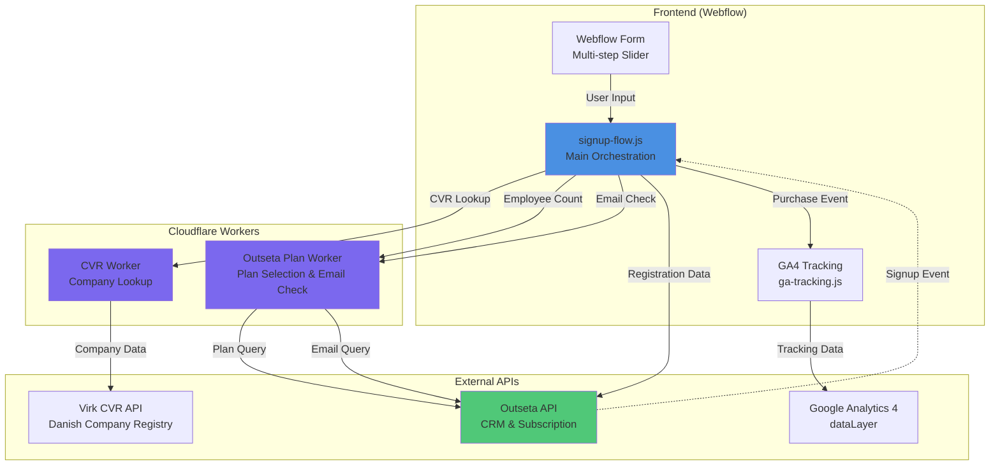
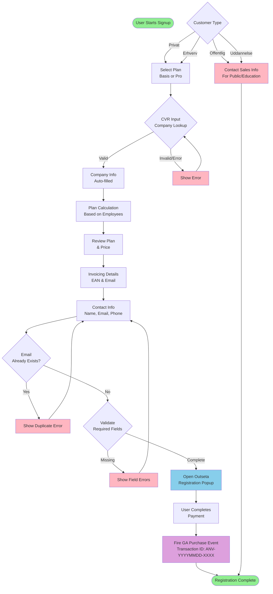
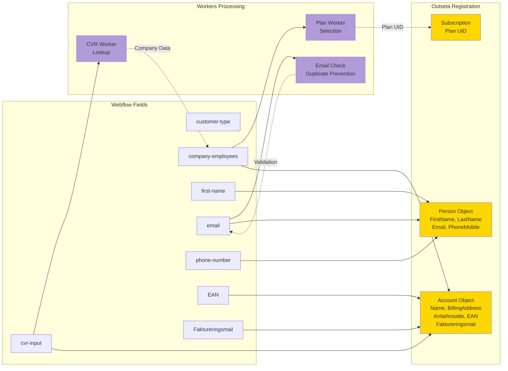

# Signup Flow

A multi-step signup flow for Webflow integrated with Outseta subscription management, Danish CVR company lookup, and Google Analytics tracking.

## Overview

This project provides a customizable JavaScript library that powers a multi-step signup form in Webflow. It handles company lookup via Danish CVR, dynamic plan selection based on employee count, email duplicate checking, and seamless handoff to Outseta for payment processing.

## Architecture



## User Flow



## Data Flow and Field Mapping



## Error Handling System

```mermaid
flowchart TD
    ERROR[Error Occurs]
    
    ERROR --> GEN_ID[Generate Error Box ID<br/>errorbox-{step}-{field}]
    
    GEN_ID --> KEBAB[Convert to Kebab Case<br/>toKebabCase function]
    
    KEBAB --> EXAMPLES[Example IDs:<br/>errorbox-cvr-cvr-input<br/>errorbox-contact-first-name<br/>errorbox-contact-email]
    
    EXAMPLES --> SHOW[Show Error Box<br/>Display Error Message]
    
    SHOW --> USER_INPUT[User Types in Field]
    
    USER_INPUT --> LISTEN[Input Event Listener]
    
    LISTEN --> CLEAR[Clear Specific Error<br/>Hide Error Box]
    
    CLEAR --> NEXT_STEP{User<br/>Continues?}
    
    NEXT_STEP -->|New Error| ERROR
    NEXT_STEP -->|Success| DONE([No Errors])
    
    style ERROR fill:#FF6B6B
    style GEN_ID fill:#4ECDC4
    style SHOW fill:#FFE66D
    style CLEAR fill:#95E1D3
    style DONE fill:#90EE90
```

## Features

- **Multi-step Form**: Smooth slider-based progression through signup steps
- **Customer Type Handling**: Four customer types (Privat, Erhverv, Offentlig, Uddannelse)
- **CVR Lookup**: Automatic Danish company lookup with auto-fill
- **Dynamic Plan Selection**: Employee-based plan calculation (Basis/Pro)
- **Email Duplicate Check**: Prevents existing users from re-registering
- **Semantic Error Handling**: Context-aware error boxes with `errorbox-{step}-{field}` pattern
- **GA4 Tracking**: Purchase event tracking with unique transaction IDs
- **Outseta Integration**: Seamless handoff for payment and subscription management
- **Client-First Compliance**: Kebab-case naming convention for all IDs

## Project Structure

```
signup-flow/
├── packages/
│   ├── signup-flow/
│   │   ├── src/
│   │   │   ├── index.js          # Main signup flow orchestration
│   │   │   └── ga-tracking.js    # Google Analytics tracking module
│   │   └── package.json
│   └── workers/
│       ├── cvr-worker/
│       │   ├── src/
│       │   │   └── index.js      # CVR lookup worker
│       │   └── wrangler.toml
│       └── outseta-plan-worker/
│           ├── src/
│           │   └── index.js      # Plan selection & email check worker
│           └── wrangler.toml
├── dist/
│   └── signup-flow.js            # Built bundle for deployment
└── package.json
```

## Installation

```bash
npm install
```

## Development

### Build the signup flow bundle:

```bash
npm run build:signup-flow
```

The built file will be output to `dist/signup-flow.js` with a timestamp.

### Deploy Cloudflare Workers:

```bash
# Deploy CVR worker
cd packages/workers/cvr-worker
wrangler deploy

# Deploy Outseta plan worker
cd packages/workers/outseta-plan-worker
wrangler deploy
```

## Configuration

The signup flow can be configured by passing options to `initSignupFlow()`:

```javascript
initSignupFlow({
  sliderId: "slider-signup",
  cvrWorkerUrl: "https://anvisninger-cvr-dev.maxks.workers.dev/cvr",
  planWorkerUrl: "https://anvisninger-outseta-planinfo.maxks.workers.dev/plans",
  emailCheckWorkerUrl: "https://anvisninger-outseta-planinfo.maxks.workers.dev/check-email",
  basisPlanUid: "BWzE5N9E",
  handOffButtonId: "hand-off-outseta",
  outsetaState: "checkout",
  gaConfig: {
    companyName: "Anvisninger",
    itemCategory: "Abonnement",
    trackPurchase: true,
  },
  // ... more options
});
```

### Key Configuration Options:

- **sliderId**: ID of the Webflow slider element
- **cvrInputId**: ID of the CVR input field
- **handOffButtonId**: ID of the button that triggers Outseta popup
- **personFieldIds**: Map of person field IDs (email, first-name, last-name, phone-number)
- **invoicingFieldIds**: Map of invoicing field IDs (EAN, Faktureringsmail)
- **radios**: Radio button configurations for customer type and plan selection
- **gaConfig**: Google Analytics tracking configuration

## Signup Flow Steps

1. **customerType**: Select customer type (Privat, Erhverv, Offentlig, Uddannelse)
2. **basisOrPro**: Select plan tier (Basis or Pro)
3. **cvr**: Enter CVR number for company lookup
4. **company**: Review auto-filled company information
5. **planReview**: Review selected plan and pricing
6. **invoicing**: Enter invoicing details (EAN, invoice email)
7. **contactSales**: Contact information for public/education customers
8. **contact**: Enter contact details (name, email, phone)

## Webflow Integration

### Required Webflow Elements:

- Multi-step slider with `data-step` attributes matching step names
- Form fields with IDs matching the configuration
- Error box elements with IDs following the pattern: `errorbox-{step}-{field}`
- Radio buttons for customer type and plan selection
- Hand-off button to trigger Outseta registration

### Element ID Conventions (Client-First):

All IDs should follow kebab-case naming:
- `customer-type` (not customerType)
- `first-name` (not firstName)
- `cvr-input` (not CVR-input)
- Error boxes: `errorbox-contact-email`, `errorbox-cvr-cvr-input`, etc.

### Critical Error Handling

Add this code to Webflow custom code (Footer) right after the signup-flow.js script tag:

```javascript
<!-- Critical error detection and handling -->
<script>
  function handleSignupFailure() {
    alert('⚠️ Det er ikke muligt at oprette sig lige nu. Prøv igen senere eller kontakt Molio support.');
    
    // TODO: Optimize error handling
    // - Show error banner instead of alert
    // - Disable form with visual feedback
    // - Add retry button
    // - Consider modal dialog instead of alert
  }

  window.addEventListener('load', () => {
    // Check 1: Library is not loaded
    if (typeof AnvisningerSignupFlow === 'undefined' || typeof AnvisningerSignupFlow.initSignupFlow !== 'function') {
      handleSignupFailure();
      return;
    }

    // Check 2: Critical error occurred in the library
    if (window.AnvisningerSignupFlow.isCritical) {
      handleSignupFailure();
      return;
    }

    // Monitor for critical errors during usage (every 2 seconds)
    setInterval(() => {
      if (window.AnvisningerSignupFlow.isCritical) {
        handleSignupFailure();
      }
    }, 2000);
  });
</script>
```

This handles critical errors when:
- Library fails to load from CDN
- Worker returns 403 (origin not allowed)
- Worker returns 5xx (server error)
- Request timeout occurs

## API Endpoints

All worker endpoints require requests from allowed origins:
- `https://anvisninger-dk-e81a432f7570a8eceb515ecb.webflow.io`
- `https://anvisninger.dk`

Requests from other origins will return a 403 Forbidden response.

### CVR Worker
- **URL**: `https://anvisninger-cvr-dev.maxks.workers.dev/cvr`
- **Method**: GET
- **Query**: `?cvr=12345678`
- **Response**: Company data from Danish CVR registry
- **Origins**: Restricted to allowed domains

### Outseta Plan Worker
- **URL**: `https://anvisninger-outseta-planinfo.maxks.workers.dev/plans`
- **Method**: POST
- **Query**: `?employees=50`
- **Response**: Appropriate plan UID and details
- **Origins**: Restricted to allowed domains

### Email Check Worker
- **URL**: `https://anvisninger-outseta-planinfo.maxks.workers.dev/check-email`
- **Method**: POST
- **Query**: `?email=user@example.com`
- **Response**: `{ exists: true/false, email, message }`
- **Origins**: Restricted to allowed domains


## Deployment

The built `dist/signup-flow.js` file is deployed to GitHub Pages and can be included in Webflow:

```html
<script src="https://anvisninger.github.io/signup-flow/dist/signup-flow.js"></script>
```

## Error Handling

Errors are displayed in dedicated error box elements with semantic IDs:

- `errorbox-cvr-cvr-input`: CVR lookup errors
- `errorbox-contact-first-name`: First name validation errors
- `errorbox-contact-last-name`: Last name validation errors
- `errorbox-contact-email`: Email validation and duplicate errors

Errors automatically clear when the user types in the associated field.

## Security

The Cloudflare Workers are configured with strict origin validation to prevent unauthorized access:

### Allowed Origins

Only requests from the following origins are accepted:
- `https://anvisninger-dk-e81a432f7570a8eceb515ecb.webflow.io` (Webflow staging/development)
- `https://anvisninger.dk` (Production domain)

Any requests from other origins will receive a 403 Forbidden response with the error message "Origin not allowed".

### CORS Configuration

- **Dynamic CORS headers**: The `Access-Control-Allow-Origin` header is dynamically set to match the requesting origin (only if it's in the allowlist)
- **Method restrictions**: Each worker specifies allowed HTTP methods
- **Header restrictions**: Only necessary headers are allowed (Content-Type, Authorization)

### Deployment Details

- **CVR Worker**: Version b465b140-7d7e-4f3f-b7a9-756a24896ae7
- **Outseta Plan Worker**: Version 3562d7db-c02d-4d96-83fb-2c4a35e828fe

Both workers were deployed on 2026-02-25 with enhanced security restrictions.

## License

MIT

## Support

For issues or questions, contact the development team.
