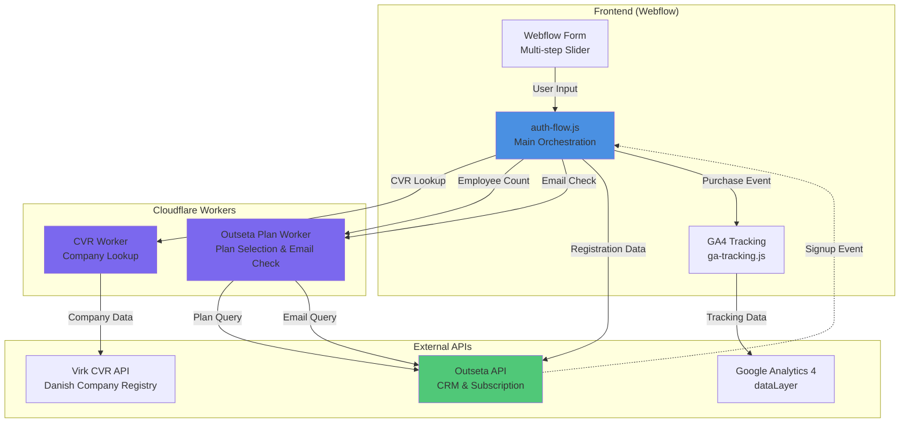
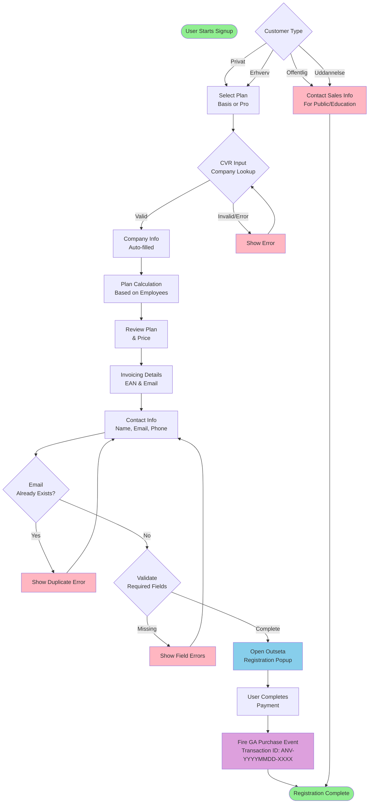
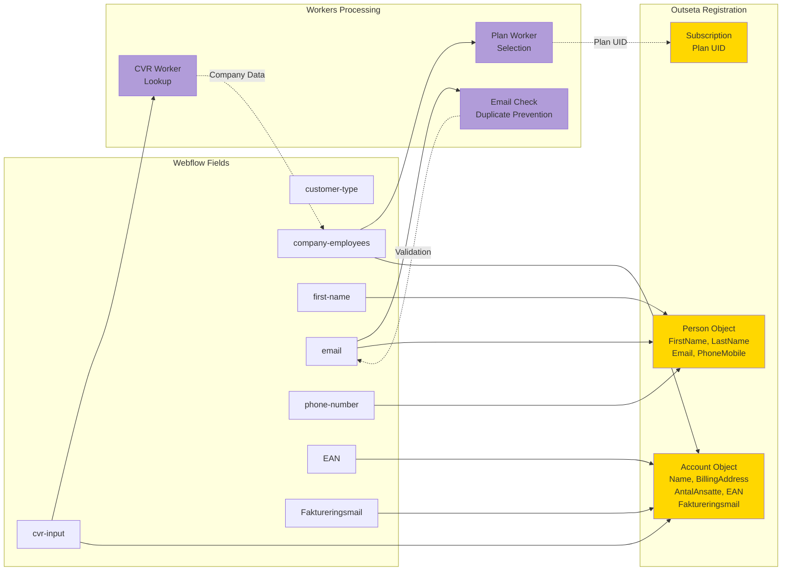

# Auth Flow

## Public Documentation Scope

This README is intentionally limited to public-safe integration and architecture information.

- Included: integration snippets, package structure, browser API, high-level flow diagrams.
- Excluded: operational secrets, internal troubleshooting notes, deployment credentials, and internal security procedures.
- Internal-only runbook is maintained locally and not committed to this repository.

## Architecture


```mermaid
graph TB
    subgraph "Frontend (Webflow)"
        WF[Webflow Form<br/>Multi-step Slider]
        JS[auth-flow.js<br/>Main Orchestration]
        GA[GA4 Tracking<br/>ga-tracking.js]
    end
    
    subgraph "Cloudflare Workers"
        CVR[CVR Worker<br/>Company Lookup]
        PLAN[Outseta Plan Worker<br/>Plan Selection & Email Check]
    end
    
    subgraph "External APIs"
        CVRAPI[Virk CVR API<br/>Danish Company Registry]
        OUTSETA[Outseta API<br/>CRM & Subscription]
        GA4[Google Analytics 4<br/>dataLayer]
    end
    
    WF -->|User Input| JS
    JS -->|CVR Lookup| CVR
    JS -->|Employee Count| PLAN
    JS -->|Email Check| PLAN
    JS -->|Registration Data| OUTSETA
    JS -->|Purchase Event| GA
    
    CVR -->|Company Data| CVRAPI
    PLAN -->|Plan Query| OUTSETA
    PLAN -->|Email Query| OUTSETA
    GA -->|Tracking Data| GA4
    
    OUTSETA -.->|Signup Event| JS
    
    style JS fill:#4A90E2
    style CVR fill:#7B68EE
    style PLAN fill:#7B68EE
    style OUTSETA fill:#50C878
```

## User Flow


```mermaid
flowchart TD
    START([User Starts Signup])
    
    CTYPE{Customer Type}
    CTYPE -->|Privat| PLAN_SEL
    CTYPE -->|Erhverv| PLAN_SEL
    CTYPE -->|Offentlig| CONTACT_SALES
    CTYPE -->|Uddannelse| CONTACT_SALES
    
    PLAN_SEL[Select Plan<br/>Basis or Pro]
    
    CVR_CHECK{CVR Input<br/>Company Lookup}
    PLAN_SEL --> CVR_CHECK
    
    CVR_CHECK -->|Valid| COMPANY_INFO[Company Info<br/>Auto-filled]
    CVR_CHECK -->|Invalid/Error| CVR_ERROR[Show Error]
    CVR_ERROR --> CVR_CHECK
    
    COMPANY_INFO --> PLAN_CALC[Plan Calculation<br/>Based on Employees]
    
    PLAN_CALC --> PLAN_REVIEW[Review Plan<br/>& Price]
    
    PLAN_REVIEW --> INVOICING[Invoicing Details<br/>EAN & Email]
    
    INVOICING --> CONTACT_INFO[Contact Info<br/>Name, Email, Phone]
    
    CONTACT_INFO --> EMAIL_CHECK{Email<br/>Already Exists?}
    EMAIL_CHECK -->|Yes| EMAIL_ERROR[Show Duplicate Error]
    EMAIL_CHECK -->|No| VALIDATE
    EMAIL_ERROR --> CONTACT_INFO
    
    VALIDATE{Validate<br/>Required Fields}
    VALIDATE -->|Missing| FIELD_ERROR[Show Field Errors]
    VALIDATE -->|Complete| OUTSETA_POPUP
    FIELD_ERROR --> CONTACT_INFO
    
    OUTSETA_POPUP[Open Outseta<br/>Registration Popup]
    
    OUTSETA_POPUP --> PAYMENT[User Completes<br/>Payment]
    
    PAYMENT --> GA_TRACK[Fire GA Purchase Event<br/>Transaction ID: ANV-YYYYMMDD-XXXX]
    
    GA_TRACK --> COMPLETE([Registration Complete])
    
    CONTACT_SALES[Contact Sales Info<br/>For Public/Education]
    CONTACT_SALES --> COMPLETE
    
    style START fill:#90EE90
    style COMPLETE fill:#90EE90
    style CONTACT_SALES fill:#FFB6C1
    style CVR_ERROR fill:#FFB6C1
    style EMAIL_ERROR fill:#FFB6C1
    style FIELD_ERROR fill:#FFB6C1
    style OUTSETA_POPUP fill:#87CEEB
    style GA_TRACK fill:#DDA0DD
```

## Data Flow and Field Mapping


```mermaid
graph LR
    subgraph "Webflow Fields"
        WF_CT[customer-type]
        WF_CVR[cvr-input]
        WF_EMP[company-employees]
        WF_NAME[first-name]
        WF_EMAIL[email]
        WF_PHONE[phone-number]
        WF_EAN[EAN]
        WF_INV[Faktureringsmail]
    end
    
    subgraph "Workers Processing"
        CVR_W[CVR Worker<br/>Lookup]
        PLAN_W[Plan Worker<br/>Selection]
        EMAIL_W[Email Check<br/>Duplicate Prevention]
    end
    
    subgraph "Outseta Registration"
        PERSON[Person Object<br/>FirstName, LastName<br/>Email, PhoneMobile]
        ACCOUNT[Account Object<br/>Name, BillingAddress<br/>AntalAnsatte, EAN<br/>Faktureringsmail]
        SUB[Subscription<br/>Plan UID]
    end
    
    WF_CVR --> CVR_W
    CVR_W -.->|Company Data| WF_EMP
    
    WF_EMP --> PLAN_W
    PLAN_W -.->|Plan UID| SUB
    
    WF_EMAIL --> EMAIL_W
    EMAIL_W -.->|Validation| WF_EMAIL
    
    WF_NAME --> PERSON
    WF_EMAIL --> PERSON
    WF_PHONE --> PERSON
    
    WF_CVR --> ACCOUNT
    WF_EMP --> ACCOUNT
    WF_EAN --> ACCOUNT
    WF_INV --> ACCOUNT
    
    style CVR_W fill:#B19CD9
    style PLAN_W fill:#B19CD9
    style EMAIL_W fill:#B19CD9
    style PERSON fill:#FFD700
    style ACCOUNT fill:#FFD700
    style SUB fill:#FFD700
```

## Current Package Structure

- `packages/auth-flow` — main signup/onboarding flow + shared browser API export
- `packages/auth-login` — login page logic (Magic + Outseta handoff)
- `packages/auth-logout` — logout page logic (Magic + Outseta logout + cleanup)
- `packages/auth-callback` — callback redirection/orchestration logic
- `packages/workers/cvr-worker` — CVR lookup and employee enrichment
- `packages/workers/outseta-plan-worker` — plan lookup and email-check endpoint

## Build

- Build bundle:
    - `node scripts/build-auth-flow.mjs`
- Output file:
    - `dist/auth-flow.js`

## Tests

- Run all tests:
    - `npm test`
- Test scope:
    - Worker request validation and rate-limiting behavior
    - Auth package export smoke checks

`dist/signup-flow.js` has been removed. Use `auth-flow.js` only.

## Browser API

The bundle exposes `window.AnvisningerAuthFlow` with:

- `initSignupFlow()`
- `initOutsetaMagicLogin()`
- `initOutsetaMagicLogout()`
- `initOutsetaAuthCallback()`

## Webflow Integration Snippets

### Signup page

Inside `<head>`:

```html
<script src="https://anvisninger.github.io/signup-flow/dist/auth-flow.js"></script>
```

Before `</body>`:

```html
<script>
    AnvisningerAuthFlow.initSignupFlow();
</script>
```

### Login page

Inside `<head>`:

```html
<script src="https://cdn.jsdelivr.net/npm/magic-sdk/dist/magic.js"></script>
<script src="https://anvisninger.github.io/signup-flow/dist/auth-flow.js"></script>
```

Before `</body>`:

```html
<script>
    AnvisningerAuthFlow.initOutsetaMagicLogin();
</script>
```

### Logout page

Inside `<head>`:

```html
<script src="https://cdn.jsdelivr.net/npm/magic-sdk/dist/magic.js"></script>
<script src="https://anvisninger.github.io/signup-flow/dist/auth-flow.js"></script>
```

Before `</body>`:

```html
<script>
    AnvisningerAuthFlow.initOutsetaMagicLogout();
</script>
```

### Callback page

Inside `<head>`:

```html
<script src="https://anvisninger.github.io/signup-flow/dist/auth-flow.js"></script>
```

Before `</body>`:

```html
<script>
    AnvisningerAuthFlow.initOutsetaAuthCallback();
</script>
```

## Magic Passwordless Login

The login page uses Magic SDK for passwordless authentication via email OTP (one-time passcode).

**User Experience:**
1. User enters email address
2. Email check runs **before** sending OTP to verify account exists
   - If no account: user is directed to signup
   - If account exists: OTP is sent
3. User enters OTP code in Magic modal
4. Error messages display in the error box on the page with clear guidance:
   - User-actionable errors (e.g., expired code) guide users to retry
   - System errors point users to support
   - Closing the Magic modal is treated as an intentional choice (no error shown)

**For integrators:**
- Magic SDK must be loaded from CDN: `https://cdn.jsdelivr.net/npm/magic-sdk/dist/magic.js`
- Auth bundle handles OTP submission and error guidance automatically
- Error messages display in an element with ID `errorbox` (required on login page)
- Magic's OTP modal handles invalid code feedback automatically in Danish
- Submit button is disabled during the Magic flow to prevent double-submission

## Rate Limiting

Worker endpoints apply abuse protection appropriate to endpoint sensitivity:

- **Email checks (login pre-check):** Allows 2 free checks, then applies escalating cooldowns for subsequent requests
  - This permits users to verify 2-4 different email addresses when unsure which they signed up with
  - Rapid enumeration attempts are slowed by progressive delays

- **Plan lookups:** Primarily protected by strict origin/method checks and caching
- **CVR lookups:** Protected with per-client throttling to deter automated bulk testing while allowing normal lookups

**User impact:** Legitimate users won't encounter rate limits. Only abuse patterns (many queries per minute) trigger cooldowns.

## Environment Notes

- On production hosts (`anvisninger.dk` and subdomains), auth cookies are written with domain `.anvisninger.dk` for cross-subdomain access.
- On staging/dev hosts (e.g. `*.webflow.io`), auth cookies are written as host-only cookies.
- This is expected and prevents invalid cross-domain cookie writes during staging tests.

